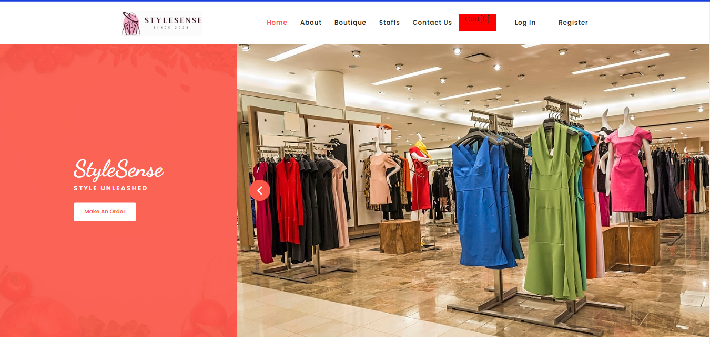
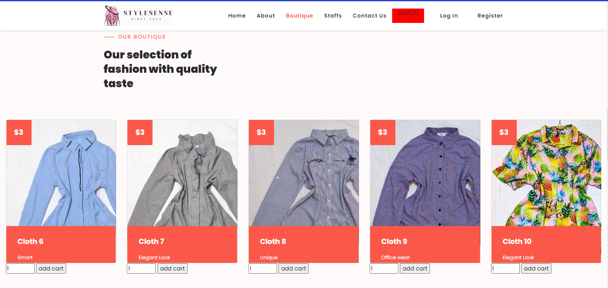
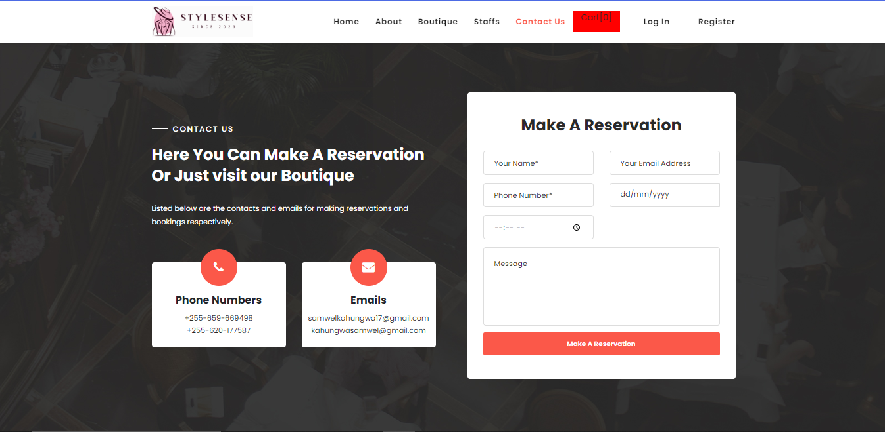

# StyleSense Shop

## Overview

StyleSense Shop is a modern and user-friendly web application for a clothing store that allows customers to explore the latest fashion trends, view clothing items, and place orders online. With its intuitive interface, it offers an immersive shopping experience, making it easier than ever for users to discover and purchase their favorite clothes from the comfort of their homes.

## Key Features

- **Product Catalog:** Browse through a wide selection of clothing items, each elegantly categorized for easy navigation.

- **User-Friendly Interface:** Enjoy a seamless shopping experience with our intuitive and responsive design.

- **Detailed Product Information:** Get in-depth information about each item, including images, descriptions, sizes, and prices.

- **User Accounts:** Create a personal account to track orders, save favorite items, and streamline the checkout process.

- **Shopping Cart:** Add and manage items in your cart before proceeding to the checkout.

- **Secure Checkout:** Feel confident about your online purchases with our secure payment processing.

- **Order History:** Access a complete history of your previous orders, making reordering a breeze.

## Preview

